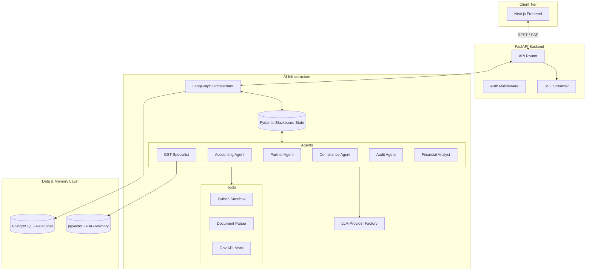

# Technical Architecture: LedgerAI

This document outlines the system architecture, data flows, and technical design decisions powering LedgerAI.

---

## High-Level System Architecture



---

## LangGraph Workflow

The orchestrator guarantees sequential and parallel execution using a Directed Acyclic Graph (DAG) with controlled cyclical retries.

```text
User 
  ↓ 
Partner Agent (Routing & Intent)
  ↓ 
Accounting Agent (Ledger Drafting)
  ↓ 
GST Agent (Tax Check) + Compliance Agent (Duplicate Check) [Parallel Execution]
  ↓ 
Audit Agent (Math & Logic Verification)
  ↓ 
Verification Layer (Hallucination & Consistency Check)
  ↓ 
HITL Pause (If rules are violated or documents missing)
  ↓ 
Financial Analyst Agent (Narrative Insights)
  ↓ 
Database Commit
```

---

## Blackboard Architecture

The **Blackboard Pattern** replaces direct conversational messaging between agents.
- **Shared State**: All agents read from and mutate a centralized Pydantic `BlackboardState`.
- **No Direct Communication**: Agents do not talk to each other in natural language, eliminating token bloat and conversational drift.
- **Pydantic Validation**: Every agent outputs a strictly typed Pydantic schema (e.g., `AccountingOutput`).
- **Reducers**: The LangGraph state machine uses reducers to safely merge individual agent output patches into the global Blackboard.

---

## RAG Pipeline

Retrieval-Augmented Generation provides deterministic compliance facts to the GST Agent.

```text
Document (IGST Act / SEZ Guidelines)
  ↓ 
Chunking (RecursiveCharacterTextSplitter)
  ↓ 
Embedding (Google text-embedding-004)
  ↓ 
pgvector Database
  ↓ 
Retriever (Hybrid Semantic Search)
  ↓ 
Context Injection
  ↓ 
GST Agent Processing
```

---

## Provider Architecture

LedgerAI completely decouples the application from the underlying LLM via a Factory pattern.

```text
BaseProvider (Interface)
  ↓ 
GeminiProvider (Implementation using langchain-google-genai)
```
*Benefit*: Future models (e.g., Anthropic, OpenAI, local LLaMA) can be hot-swapped by simply creating a new class that implements the `BaseProvider` contract, requiring absolutely zero changes to the agents.

---

## Verification Pipeline

Verification is treated as a first-class citizen, running natively before any transaction is approved.

```text
Audit Agent (Proposes Approval)
  ↓ 
Python Calculator (AST-evaluated Math Verification)
  ↓ 
Confidence Check (Evaluating LLM certainty)
  ↓ 
Consistency Check (Contradiction detection across Blackboard fields)
  ↓ 
Approve / Retry (Return to Accounting) / HITL (Interrupt)
```

---

## Folder Structure

```text
backend/
├── ai/
│   ├── agents/         # LangGraph node implementations
│   ├── memory/         # Pydantic Blackboard state
│   ├── prompts/        # Markdown prompts and PromptManager
│   ├── providers/      # LLM Factory and abstractions
│   ├── rag/            # Embeddings, chunker, vector store
│   ├── schemas/        # Agent-specific Pydantic schemas
│   ├── tools/          # Python Sandbox (asteval)
│   ├── verification/   # Confidence, consistency, validators
│   └── workflows/      # LangGraph DAG, routers, reducers, checkpoints
├── api/                # FastAPI routes
├── config/             # Settings and constants
├── database/           # Sessions and Alembic setup
├── exceptions/         # Custom error classes
├── middleware/         # Request ID logging
├── models/             # Relational ORM models
├── observability/      # Central logger and telemetry
├── schemas/            # API response models
├── services/           # Backend business logic
└── utils/              # Shared helper scripts
tests/                  # Independent module tests
```

---

## Design Decisions

- **LangGraph**: Chosen over AutoGen/CrewAI because it provides deterministic edge routing, state graph definition, and native checkpointing required for pausing workflows for Human-in-the-Loop input.
- **Blackboard Pattern**: Chosen to enforce highly structured JSON mutations rather than tracking massive, unmanageable conversational histories between multiple agents.
- **PostgreSQL + pgvector**: Chose a unified database layer to handle both relational transactional data and vector embeddings, drastically simplifying the infrastructure footprint for deployment.
- **Gemini**: Utilized Gemini 2.5 Pro for its massive context window, exceptional reasoning capabilities, and seamless integration with Google's native embeddings.
- **Pydantic**: Enforces strict typing for the API, the LLM structured outputs, and the Blackboard state, acting as the ultimate guardrail against hallucinated schema fields.
- **Upload Storage (Runtime Data Privacy)**: User-uploaded documents (e.g. bank statements, invoices) are considered sensitive runtime data and are **strictly** decoupled from the source code repository. Uploads are stored in an OS-specific application data directory (e.g. `%LOCALAPPDATA%/LedgerAI/uploads` on Windows) managed by `platformdirs`. This prevents accidental git commits of sensitive user data and decouples the runtime environment from the development environment.
