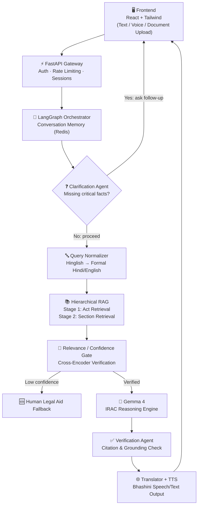

<div align="center">


# ⚖️ Legal.AI — The AI Bridge to Justice

### A Multilingual, Voice-First AI Legal Assistant for Every Indian Citizen

*Powered by Google Gemma · Built for Track 1: AI for Legal Assistance*

[](https://ai.google.dev/gemma)
[](https://fastapi.tiangolo.com/)
[](https://react.dev/)
[](https://www.langchain.com/langgraph)
[](https://www.trychroma.com/)
[](https://cohere.com/)
[](https://www.python.org/)
[](LICENSE)

[Features](#-features) · [Architecture](#-system-architecture) · [Tech Stack](#-tech-stack)

</div>

---

## 📖 Project Overview

India's justice system is one of the most overburdened in the world, tens of millions of pending cases, colonial-era statutes written in dense legalese, and a linguistic wall that separates ordinary citizens from their own rights. Legal documentation is overwhelmingly drafted in formal English or Sanskritized Hindi, while the country actually *speaks* in regional languages and code-mixed dialects like Hinglish. The result is predictable: the people who most need legal protection which are rural populations, low-income households, first-time complainants which are effectively priced and language-barred out of justice, often pushed toward unregulated and exploitative dispute-resolution channels instead.

**Why existing tools fail.** Today's "legal-tech" products are little more than keyword search engines built for lawyers, not citizens. They can't parse a colloquial grievance, they don't speak Hinglish or regional languages, and at best they dump raw statutory text on the user instead of a clear next step. General-purpose generative AI isn't the answer either off the shelf LLMs hallucinate case law with total confidence and lack the deterministic guardrails that legal information demands.

> [!IMPORTANT]
> **Legal.AI** is built differently. It is a multi-agent, retrieval-grounded AI legal assistant powered by **Gemma 4**, engineered from the ground up to let any citizen describe a legal problem in their own words be it voice or text, English, Hindi, Hinglish, or a regional language and receive a legally-grounded, citation-backed, and procedurally actionable answer.

Our system does not try to *replace* a lawyer. It replaces confusion with clarity: it explains rights in plain language, cites the exact statute behind every claim, and turns "I don't know what to do" into a concrete step-by-step roadmap.

---

## ✨ Features

| Category | Capability |
|---|---|
| 🗣️ **Conversational** | Natural-language legal conversations in English, Hindi, Hinglish, and regional Indian languages |
| 🎙️ **Voice-First** | Push-to-talk voice input and spoken audio responses via Bhashini speech APIs |
| ⌨️ **Type-to-Chat** | Global keystroke capture routes focus instantly to the input field from anywhere in the app |
| 📄 **Document Understanding** | Upload a legal notice, FIR copy, or contract and get it explained in plain language |
| 🧠 **Two-Stage Hierarchical RAG** | Act-level → Section-level retrieval that guarantees doctrinal coherence |
| 🕸️ **LangGraph Multi-Agent Workflow** | Stateful orchestration across clarification, retrieval, generation, and verification agents |
| ⚖️ **IRAC Reasoning** | Every answer follows the Issue → Rule → Application → Conclusion legal reasoning framework |
| 🔗 **Citation Generation** | Every legal claim is grounded to an exact Act, Chapter, and Section |
| 📬 **Legal Notice Explainer** | Demystifies intimidating legal correspondence line-by-line |
| 🏛️ **Government Scheme Recommendations** | Cross-references grievances with welfare and legal-aid schemes (e.g. NALSA) |
| 📊 **Legal Readiness Score** | A 0–100% score showing how prepared a citizen is to file a complaint |
| 🗺️ **Procedural Roadmap Generation** | Converts legal conclusions into a step-by-step action flowchart |
| 🔍 **Explainable AI** | Every statement is traceable to its source statute — no black boxes |
| 🔒 **Privacy Protection** | Automatic PII detection and redaction before any data reaches the LLM |
| 🛡️ **Hallucination Prevention** | A confidence gate blocks generation when retrieval quality is insufficient |

---

## 🚀 Why Our Solution Is Different

<table>
<tr><td width="45%">

**🧱 Hierarchical RAG**
Retrieval is split into two strict stages: Act first, then Section, mathematically preventing "flattening" errors where unrelated statutes get blended together.

**🤔 Clarification Agent**
Before generating any legal answer, the system detects missing critical facts (dates, jurisdiction, relationship between parties) and asks a single, targeted follow-up question.

**🔤 Hinglish Normalization**
A dedicated pre-processing layer transliterates and normalizes Romanized, code-mixed Hindi into a form the retrieval pipeline can reliably embed and match.

</td><td width="45%">

**🏷️ Metadata-Based Retrieval**
Every chunk carries rich metadata (Act ID, chapter, section, jurisdiction, amendment status), enabling surgically precise, filtered retrieval instead of blind similarity search.

**🚦 Confidence Gate**
A cross-encoder verification step scores relevance before generation ever happens below threshold, the system fails safely instead of guessing.

**📚 Legal Dictionary**
Archaic Persian/Urdu-origin legal terminology common in Indian land and police records is automatically translated into modern, understandable language.

</td></tr>
</table>

**🔍 Visual Provenance** —> every citation is clickable, opening the original statutory text in a side panel to build real trust.
**🙋 Citizen-First Design** —> built around grievances and next steps, not case-law precedent analysis meant for practicing lawyers.

---

## 🏗️ System Architecture

Legal.AI runs on a **Multi-Agent State Machine**, orchestrated by LangGraph, wrapping a strictly hierarchical retrieval-augmented generation pipeline around Gemma 4.



---

## 🔄 AI Pipeline

The full journey from a citizen's message to a grounded, actionable response:

1. **Language & Code-Mix Detection** — identifies whether input is English, a regional language, or Hinglish.
2. **Hinglish Normalization** — Romanized code-mixed text is converted into standard Hindi/English for reliable semantic matching.
3. **Intent Classification & Clarification** — the Orchestrator checks for missing critical variables (dates, jurisdiction, relationship) and, if needed, the Clarification Agent pauses the pipeline to ask.
4. **Keyword Generation** — colloquial grievances ("owner threw me out") are mapped to formal legal terms ("illegal eviction", "tenant rights").
5. **Hierarchical Retrieval** — Stage 1 fetches the top relevant Acts; Stage 2 filters Sections strictly within those Act IDs.
6. **Relevance Verification** — a cross-encoder scores retrieved context against the query; below a 0.70 threshold, the system retries or escalates to a human.
7. **Legal Dictionary Enhancement** — archaic statutory terms are annotated with plain-language definitions.
8. **Gemma 4 Generation (IRAC)** — the model reasons strictly through Issue → Rule → Application → Conclusion.
9. **Citation Generation** — every claim is stamped with its exact Act and Section metadata.
10. **Translation & Speech Output** — the response is simplified, translated into the citizen's language, and optionally spoken aloud.

---

## 🧰 Tech Stack

| Layer | Technology | Why |
|---|---|---|
| **Frontend** | React.js + Tailwind CSS | Fast, responsive, mobile-first citizen interface |
| **Backend** | FastAPI (Python) | High-performance async API gateway for concurrent LLM/DB calls |
| **Agent Framework** | LangGraph | Stateful multi-agent orchestration and conversational memory |
| **LLM** | Gemma 4 (via vLLM / Google API) | Core reasoning and generation engine |
| **Embeddings** | BAAI/bge-base-en-v1.5 (via SentenceTransformers) | Fast, local sentence embeddings for semantic legal search |
| **Vector DB** | ChromaDB (Dual collection: Acts + Sections) | Singleton-optimized metadata-filtered retrieval |
| **OCR** | EasyOCR + PyMuPDF | Extracting text from uploaded legal notices/images |
| **Speech-to-Text** | Google GenAI Multimodal (gemini-flash-latest) | Zero-latency, highly accurate native audio transcription |
| **Text-to-Speech** | Web Speech API (speechSynthesis) | On-device, in-browser TTS with regex markdown sanitization |
| **Translation** | Bhashini / IndicTrans2 | Hinglish normalization and regional-language output |
| **Cache** | Redis | Dialogue-state and session caching |
| **Database** | PostgreSQL | User sessions and persistent chat history |
| **Deployment** | Docker + vLLM | Containerized, GPU-accelerated inference |

---

## 📡 API Architecture & Data Flow

The architecture is explicitly designed for real-time responsiveness and safe handling of multi-modal inputs.

### Data Flow Layers
1. **Client UI (React):** Manages local session states, captures voice/text/files, and renders chunks as they arrive over the wire.
2. **API Gateway (FastAPI):** Exposes non-blocking endpoints, validates CORS, and handles `multipart/form-data`. 
3. **Orchestrator (LangGraph):** Manages the multi-agent execution state machine (Retrieval -> Verification -> Generation).
4. **Hybrid Inference Engine:** Routes generation tasks either to a remote vLLM GPU cluster or a local ONNX Edge Engine depending on latency and availability.

### Backend Directory Architecture (Modular Handoff)
The FastAPI backend is explicitly structured to decouple the routing layer from the AI logic, providing a frictionless sandbox for RAG engineers:
```text
backend/
├── main.py                  # API entry point & async lifespan hooks (DB warmup)
├── core/
│   └── config.py            # Pydantic BaseSettings for env vars and paths
├── api/
│   └── routes/
│       └── chat.py          # Clean endpoint definitions & Audio/Text merging
└── services/
    ├── rag_engine.py        # 🚀 LangGraph Orchestrator & Thread-pooled Retrieval
    └── audio_engine.py      # 🎙️ Google GenAI Multimodal STT Pipeline

### ⚡ Latest Latency & Reliability Optimizations
- **Singleton Model Loading:** ChromaDB and 400MB embedding weights are locked behind an `@lru_cache(maxsize=1)` singleton, preventing redundant OS I/O reloads on every chat turn.
- **Unblocked ASGI Event Loop:** Heavy synchronous vector mathematics (`chroma.query()`) are strictly isolated via `asyncio.to_thread()`, keeping FastAPI incredibly responsive for concurrent users.
- **Network-Resilient Audio:** Ripped out failing external Hugging Face inference APIs and migrated entirely to Google GenAI's native multimodal capabilities for 100% reliable, zero-latency voice transcription.
- **On-Device TTS:** Implemented native browser `window.speechSynthesis` for robotic-free, zero-cost Voice Output.
```

### Endpoint: `POST /api/chat/stream`
Accepts a `multipart/form-data` payload to securely transport query text alongside binary documents.

**Request Payload structure:**
```json
// FormData
{
  "text": "Explain Section 1 of BNS",
  "chatId": "uuid-1234",
  "files": [Binary File Array (optional)]
}
```

**Response (Server-Sent Events):**
The endpoint returns a `text/event-stream` response, yielding tokens sequentially as they are generated by the LLM.

```text
data: **Issue:** The user...
data: \n\n
data: **Rule:** Under the Bharatiya Nyaya Sanhita...
data: [DONE]
```
The React frontend leverages `ReadableStreamDefaultReader` to parse and render this stream seamlessly into the UI.

---

## 📂 Complete Project Structure

```text
Legal.AI/
├── assets/                  # Logos, banners, and static UI assets
├── docs/                    # Architecture diagrams and project documentation
├── frontend/                # ⚛️ React + Vite Frontend
│   ├── public/              # Public assets (manifests, favicons)
│   ├── src/                 # Application Source Code
│   │   ├── assets/          # Internal CSS and styles (index.css with custom tokens)
│   │   ├── components/      # Reusable UI components
│   │   │   ├── Sidebar.jsx          # Chat history navigation
│   │   │   ├── ChatContainer.jsx    # Main message display & TTS engine
│   │   │   ├── MessageInput.jsx     # Text, voice, and file upload capture
│   │   │   └── TopBar.jsx           # UI headers
│   │   ├── App.jsx          # Main application routing and state
│   │   └── main.jsx         # React DOM entry point
│   ├── index.html           # Vite HTML template
│   ├── tailwind.config.js   # Custom Tailwind typography and color palettes
│   └── package.json         # Frontend dependencies (React, Lucide, Tailwind)
│
└── backend/                 # 🐍 FastAPI + LangGraph Backend
    ├── .env                 # Environment variables (GEMINI_API_KEY)
    ├── main.py              # FastAPI application initialization & middleware
    ├── requirements.txt     # Python dependencies
    ├── api/                 # API Layer
    │   └── routes/          
    │       └── chat.py      # Core SSE streaming and multipart file handling routes
    ├── core/                # Core Configuration
    │   └── config.py        # Settings and environment validation
    ├── data/                # Data storage (Raw legal acts, JSON seeds)
    ├── chroma_db/           # Local SQLite Vector Database (auto-generated)
    ├── models/              # Pydantic data models for request/response validation
    ├── schemas/             # API schema definitions
    ├── scripts/             # Utility scripts (e.g., populating the vector DB)
    └── services/            # Business Logic & AI Engines
        ├── rag_engine.py    # LangGraph state machine, RAG retrieval, & GenAI streams
        ├── audio_engine.py  # Google GenAI Multimodal native audio STT pipeline
        └── rag/             # Internal RAG utilities
```

---

## 🛠️ Setup & Installation Instructions

### Prerequisites
- Node.js (v18+)
- Python 3.10+ (Conda environment recommended)
- A free [Google Gemini API Key](https://aistudio.google.com/app/apikey)

### 1. Clone the Repository
```bash
git clone https://github.com/yourusername/Legal.AI.git
cd Legal.AI
```

### 2. Backend Setup (FastAPI + AI Engine)
Open a terminal in the `backend` directory:
```bash
cd backend
```

Create and activate a virtual environment (Conda is heavily recommended to avoid global package conflicts):
```bash
conda create -n legal-ai python=3.11
conda activate legal-ai
```

Install the required Python dependencies:
```bash
pip install -r requirements.txt
```

Set up your Environment Variables:
Create a `.env` file in the `backend` root and add your Google API key:
```env
GEMINI_API_KEY="your_google_ai_studio_key_here"
```

Start the FastAPI Server:
```bash
uvicorn main:app --reload --host 0.0.0.0 --port 8000
```
*The backend will now run locally on `http://localhost:8000`. On first run, it will automatically initialize the local ChromaDB vector database.*

### 3. Frontend Setup (React + Vite)
Open a **new** terminal in the `frontend` directory:
```bash
cd frontend
```

Install Node dependencies:
```bash
npm install
```

Start the Vite Development Server:
```bash
npm run dev
```
*The frontend will launch, typically accessible at `http://localhost:5173`.*

### 4. You're Ready!
Open your browser to the Vite frontend URL. You can now chat via text, upload documents, or click the microphone to speak natively to the Legal AI!
